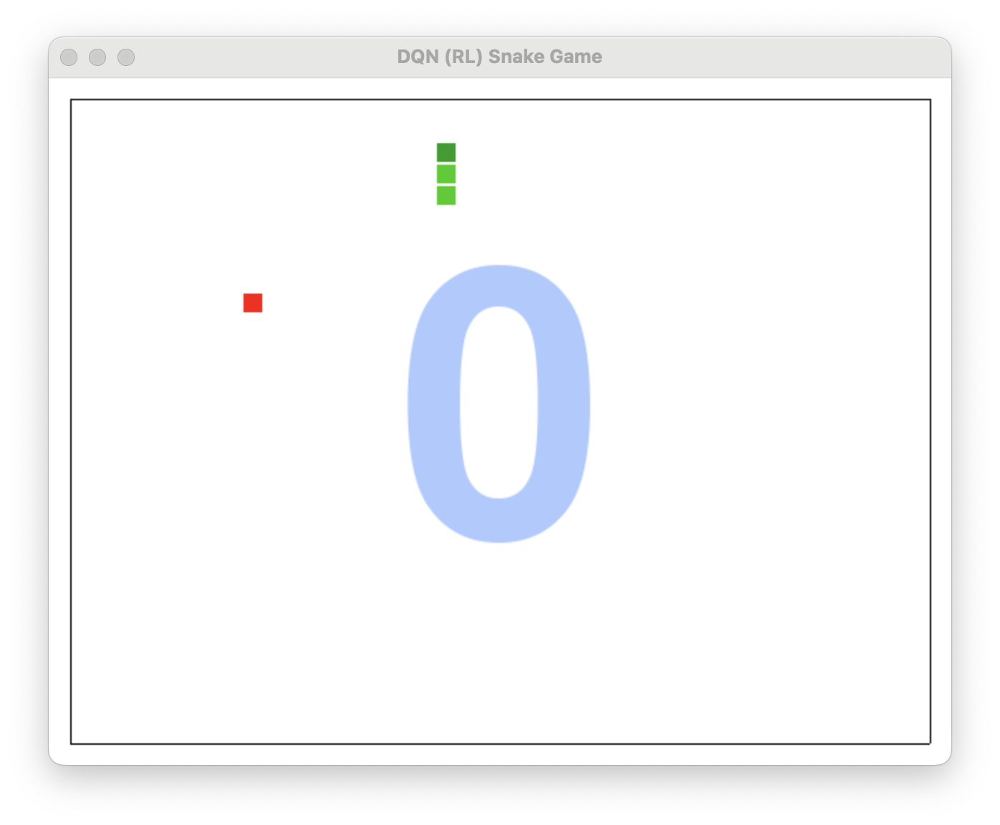

# 🐍 DQN (RL) Snake Game in Python

A simple Snake Game built with **Pygame**, trained using **Deep Q-Learning (DQN)**.  
This project demonstrates reinforcement learning in action—teaching an agent to play the classic Snake game from scratch using its own experiences.

This project implements a **Deep Q-Learning (DQN)** agent to play the classic Snake game. The AI learns to play the game through reinforcement learning in action-teaching, using **Pygame** for visualization and a simple MLP neural network in Pytorch to train the agent.

---

## 🧠 Deep Q-Learning (DQN)

The AI agent uses Deep Q-Learning to learn how to play the Snake game. It interacts with the environment, stores experiences in memory, and learns optimal actions via Q-value estimation using a neural network.

Key concepts used:

- Experience Replay
- Epsilon-Greedy Strategy
- Target Network
- State Representation (Grid-based)

---

## 🛠 Features

- ✅ Deep Q-Network (DQN) reinforcement learning agent
- ✅ MLP Neural Network for Q-value approximation
- ✅ Replay Buffer for storing experiences
- ✅ Pygame-based Snake game UI
- ✅ Training visualization
- ✅ Model saving and loading
- ✅ Realtime training visualization

---

## 🚀 Getting Started

### Prerequisites

- Python 3.9+
- Pygame
- Pytorch 2.6 
- NumPy 1.23.5

### Usage
Python main.py

## Acknowledgments

I would like to acknowledge the contributions of [Contributor's GitHub Page](https://github.com/LetTheCodePlay/OpenAIGym.git) for providing valuable insights into reinforcement learning and for providing the initial code.

## Licence 
This project is licensed under the MIT License - see the LICENSE file for details.
